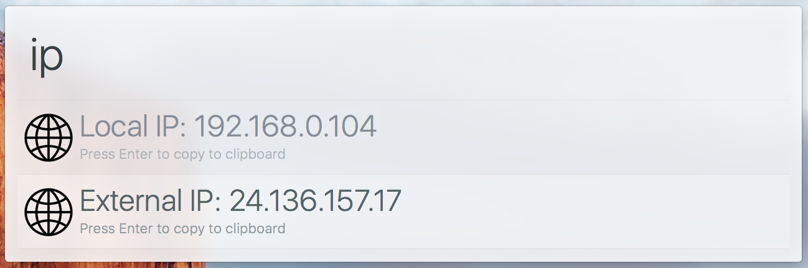

# alfred-ipaddress

> [Alfred 3](https://www.alfredapp.com) workflow to display internal/external IP addresses



## Install

```
$ npm install --global alfred-ipaddress
```

*Requires [Node.js](https://nodejs.org) 4+ and the Alfred [Powerpack](https://www.alfredapp.com/powerpack/).*


## Usage

In Alfred, type `ip`, <kbd>Enter</kbd>, and your IP addresses will be displayed.


## License

MIT (c) Steve Agalloco. See [LICENSE](https://github.com/stve/alfred-ipaddress/blob/master/LICENSE.md) for details.
